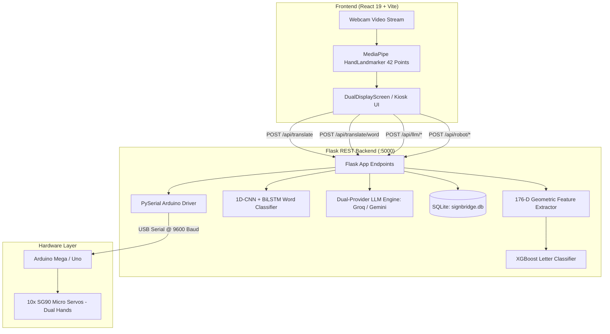

# SignBridge: Dual-Communication Indian Sign Language (ISL) Translation & Robotic Actuation System

[](https://react.dev/)
[](https://vitejs.dev/)
[](https://www.python.org/)
[](https://flask.palletsprojects.com/)
[](https://pytorch.org/)
[](https://xgboost.readthedocs.io/)
[](https://developers.google.com/mediapipe)
[](https://opensource.org/licenses/MIT)

> **A real-time, bidirectional assistive communication platform translating Indian Sign Language (ISL) to text/speech and converting natural spoken language into physical dual-robotic hand gestures.**

---

## Table of Contents

- [Project Overview](#-project-overview)
- [Key Features](#-key-features)
- [Tech Stack](#-tech-stack)
- [System Architecture](#-system-architecture)
- [Project Workflow](#-project-workflow)
- [Project Structure](#-project-structure)
- [Installation & Setup](#-installation--setup)
- [Environment Variables](#-environment-variables)
- [Usage](#-usage)
- [API Documentation](#-api-documentation)
- [AI/ML Model Details](#-aiml-model-details)
- [Security](#-security)
- [Testing & Validation](#-testing--validation)
- [Screenshots & Demo](#-screenshots--demo)
- [Performance Benchmarks](#-performance-benchmarks)
- [Limitations](#-limitations)
- [Future Improvements](#-future-improvements)
- [Contributing](#-contributing)
- [License](#-license)
- [Acknowledgements](#-acknowledgements)

---

## Project Overview

Communication barriers between the Deaf and Hard-of-Hearing (DHH) community and hearing individuals remain a significant hurdle in healthcare, public administration, education, and daily life. Indian Sign Language (ISL) is predominantly **two-handed**, distinguishing it from single-handed sign languages such as ASL and rendering standard single-hand translation software ineffective.

**SignBridge** is an end-to-end, two-way assistive communication system engineered specifically for Indian Sign Language. It provides:
1. **Vision-to-Speech (Deaf $\rightarrow$ Hearing)**: Real-time computer vision tracking 42 landmarks across both hands, classifying static fingerspelling and dynamic vocabulary gestures, and using Large Language Models (LLMs) to refine recognized fragments into grammatically fluent sentences.
2. **Speech-to-Physical Sign (Hearing $\rightarrow$ Deaf)**: A speech processing pipeline that simplifies spoken input into core ISL keyword glosses and drives a 10-servo dual robotic hand setup via serial communication to physically perform the gestures.

### Target Beneficiaries
- **Deaf & Hard-of-Hearing Individuals**: Express themselves naturally using two-handed ISL gestures without requiring a human interpreter.
- **Hearing Individuals & Public Service Staff**: Hospitals, railway help desks, banks, and educational institutions interacting seamlessly with DHH individuals.

---

## Key Features

- **Dual-Hand Real-Time Landmark Tracking**: Processes 42 landmark points ($21 \times 2$ hands in 3D space = 126 coordinates) at 30 FPS using MediaPipe HandLandmarker with zero manual keypoint latency.
- **Multi-Tier Machine Learning Pipeline**:
  - **Single-Frame Alphabet Classifier (XGBoost)**: Classifies 26 ISL manual alphabet signs (A–Z) using 176-D scale- and rotation-invariant geometric features.
  - **Dynamic Word Gesture Recognizer (1D-CNN + BiLSTM)**: Classifies temporal 30-frame sequence gestures for full-word ISL signs (e.g., `NAMASTE`, `HELLO`, `THANK_YOU`, `DEAF`, `HEARING`).
  - **Spatial-Temporal Graph Convolution (ST-GCN)**: PyTorch kinematic graph model capturing anatomical bone constraints across 42 hand joints.
- **LLM Linguistic Refinement & Simplification**:
  - **ISL-to-English Reconstruction**: Converts raw letter buffers and Topic-Comment/SOV gloss fragments into fluent sentences via Groq LPU (Llama-3.3-70B) with automatic fallback to Google Gemini (2.0/2.5 Flash).
  - **English-to-Gloss Simplification**: Strips auxiliary filler words and maps complex spoken sentences into sequential ISL keywords for physical execution.
- **Physical Dual Robotic Hand Actuation**: Drives 10 SG90 micro-servos (5 per hand) over PySerial connected to an Arduino Mega/Uno using JSON angle matrices.
- **Dual Live & Demo Modes**: Seamlessly switches between live camera/hardware inference and simulated typewriter feeds for offline demonstrations and testing.
- **Assistant Suite & Interactive Learning**: Integrated bottom sheet drawer with live sign verification, practice mode, conversation history, and in-browser dataset collection tools.
- **Persistent Conversation Logging**: Embedded SQLite database (`signbridge.db`) recording communication transcripts, speaker tags, and confidence scores.

---

## Tech Stack

| Category | Technology | Description |
| :--- | :--- | :--- |
| **Frontend** | React 19, Vite 8 | Single-page reactive application and kiosk user interface |
| **Frontend Styling** | Vanilla CSS, CSS Variables | Glassmorphic design tokens, responsive dual-panel split screen |
| **Icons & Animation** | Lucide React, Framer Motion | Modern UI icons and smooth state transitions |
| **Backend Framework** | Python 3.10+, Flask 3.0 | Lightweight REST API server with Flask-CORS |
| **Database** | SQLite 3 | Embedded relational storage for session logs and dataset collection |
| **Computer Vision** | Google MediaPipe | Dual-hand landmark extraction and tracking pipeline |
| **Machine Learning** | XGBoost, Scikit-Learn | High-speed gradient-boosted tree classifier for static letters |
| **Deep Learning** | PyTorch 2.0+, Keras / TensorFlow | 1D-CNN + BiLSTM sequence modeling and ST-GCN hand graph models |
| **LLM Inference** | Groq SDK, Google GenAI SDK | Llama-3.3-70B (sub-100ms) and Gemini 2.0/2.5 Flash fallback |
| **Hardware Control** | PySerial, Arduino (C++) | USB serial protocol driving 10x SG90 servos across two hands |
| **Containerization** | Docker, Docker Compose, Nginx | Multi-stage Dockerfiles and Nginx reverse proxy configuration |
| **Orchestration** | Kubernetes Manifests (`k8s/`) | Declarative deployments, services, ingress, and configmaps |

---

## System Architecture



---

## Project Workflow

1. **Video Ingestion & Landmark Extraction**:
   - The user signs in front of the browser webcam.
   - MediaPipe detects dual hands and streams 42 normalized $(x, y, z)$ coordinates (126 floating-point values) to the frontend hooks.
2. **Feature Extraction & Normalization**:
   - For letters: The backend normalizes coordinates relative to the wrist anchor and hand scale, computing 36 intra-hand geometric invariants and 14 cross-hand interaction distances (176 features total).
   - For words: A sliding 30-frame temporal buffer is compiled with motion velocity pre-gating ($>0.015\text{ units/frame}$).
3. **Model Inference & Temporal Gating**:
   - XGBoost predicts the static alphabet (A–Z) or CNN-BiLSTM predicts whole-word gestures (`NAMASTE`, `HELLO`, etc.).
   - Confidence thresholding ($\ge 0.50$ for letters, $\ge 0.60$ for words) and streak stability confirmation commit recognized signs to a text buffer.
4. **Linguistic Sentence Reconstruction**:
   - The raw gloss buffer is dispatched to the LLM engine (`/api/llm/refine`).
   - Groq/Gemini applies ISL grammatical transformation (converting Topic-Comment order to natural English).
5. **Speech Output & Robotic Sign Actuation**:
   - The refined sentence is spoken aloud via Web Speech API (TTS).
   - When a hearing user replies, their speech is converted to text, simplified into ISL keywords (`/api/llm/simplify`), and sent via PySerial to the Arduino to actuate the physical robotic hands.

---

## Project Structure

```text
SignBridge/
├── backend/
│   ├── app.py                      # Main Flask application, REST endpoints, and LLM orchestrator
│   ├── requirements.txt            # Python dependencies
│   ├── extract_static_landmarks.py # Batch landmark extractor for static image datasets
│   ├── extract_video_landmarks.py  # Batch temporal sequence extractor with augmentations
│   ├── train_unified.py            # Unified training pipeline for XGBoost & CNN-BiLSTM models
│   ├── database/
│   │   ├── schema.py               # SQLite schema setup and query helpers
│   │   └── signbridge.db           # SQLite database file
│   ├── models/
│   │   ├── hand_landmarker.task    # MediaPipe HandLandmarker binary task model
│   │   ├── isl_xgboost_model.pkl   # Trained XGBoost ISL alphabet classifier
│   │   ├── xgb_training_meta.json  # Training metadata & per-class alphabet metrics
│   │   ├── isl_cnn_lstm_word_model.pt # Trained PyTorch CNN-BiLSTM word classifier
│   │   ├── cnn_lstm_training_meta.json # Training metadata & per-class word metrics
│   │   └── st_gcn.py               # PyTorch Spatial-Temporal Graph Convolution module
│   └── services/
│       ├── translator_model.py     # Static ISL recognition service (XGBoost -> DL -> Heuristic)
│       ├── word_recognizer.py      # Temporal ISL word recognizer service
│       ├── feature_extractor.py    # 176-D geometric invariant feature extraction pipeline
│       ├── data_loader.py          # Leak-free partitioned dataset loader
│       └── arduino_serial.py       # PySerial hardware driver and servo angle lookup
├── src/
│   ├── App.jsx                     # Root application component
│   ├── main.jsx                    # React DOM entrypoint
│   ├── index.css                   # Global theme tokens, typography, and layout styles
│   ├── components/
│   │   ├── SignBridgeKiosk.jsx     # Main kiosk split-screen container
│   │   ├── HumanPanel.jsx          # Deaf signer interface (camera view, live buffer, TTS)
│   │   ├── RobotPanel.jsx          # Hearing user interface (voice input, robotic status)
│   │   ├── CameraView.jsx          # Live camera feed, tracking canvas, and mode selector
│   │   ├── GestureReferenceSheet.jsx # Interactive 26-letter ISL reference guide
│   │   └── SignLanguageAssistant/  # Assistant sheet, tabs, and sentence builder
│   │       ├── AssistantBottomSheet.jsx
│   │       ├── HandTrackingOverlay.jsx
│   │       ├── SentenceBuilder.jsx
│   │       └── tabs/               # LiveDetection, Practice, Learn, History, DataCollection tabs
│   ├── hooks/
│   │   ├── useISLTranslation.js    # Core translation state, message streams, API synchronization
│   │   ├── useHandDetection.js     # MediaPipe hand tracker hook
│   │   ├── useGestureRecognition.js# Temporal smoothing, gating, and prediction state machine
│   │   ├── useWebcam.js            # Video stream acquisition and device enumeration
│   │   └── useAssistantHistory.js  # Assistant history management
│   ├── data/
│   │   ├── gestureData.js          # Static ISL gesture diagrams and SVG paths
│   │   └── islConversations.js     # Demo conversation pools for simulated mode
│   └── utils/
│       └── oneEuroFilter.js        # 1€ filter for real-time landmark jitter reduction
├── dataset/                        # Integrated ISL benchmark datasets (RealSign, Self-Made, Words)
├── k8s/                            # Kubernetes deployment and service manifests
├── Dockerfile.backend              # Backend Docker containerization
├── Dockerfile.frontend             # Frontend Nginx containerization
├── docker-compose.yml              # Multi-container orchestration
├── package.json                    # Node.js dependencies and scripts
├── vite.config.js                  # Vite bundler configuration and backend proxy
└── README.md                       # Project documentation
```

---

## 🚀 Installation & Setup

### Prerequisites
- **Node.js**: `v18.0.0` or higher
- **Python**: `v3.10` or higher
- **Git**
- *(Optional for Hardware)*: Arduino IDE with Arduino Uno/Mega and 10x SG90 servos

---

### 1. Clone the Repository
```bash
git clone https://github.com/Chintannn-c/Sign-Bridge-.git
cd Sign-Bridge-
```

---

### 2. Backend Setup
```bash
# Navigate to backend directory
cd backend

# Create and activate a virtual environment
# Windows:
python -m venv .venv
.venv\Scripts\activate
# macOS/Linux:
# python3 -m venv .venv
# source .venv/bin/activate

# Install Python dependencies
pip install -r requirements.txt

# Create environment configuration
cp .env.example .env
```

---

### 3. Frontend Setup
```bash
# Return to root directory
cd ..

# Install npm packages
npm install
```

---

### 4. Running the Application

Open two terminal windows:

**Terminal 1 (Backend API):**
```bash
cd backend
python app.py
```
*Backend runs on `http://localhost:5000`.*

**Terminal 2 (Frontend Dev Server):**
```bash
npm run dev
```
*Frontend runs on `http://localhost:5173`.*

---

## Environment Variables

Configure `backend/.env` with your API credentials:

```env
# Groq API Key for sub-100ms real-time LLM inference (Primary)
GROQ_API_KEY=gsk_your_groq_api_key_here

# Google Gemini API Key for fallback LLM inference (Secondary)
GOOGLE_API_KEY=your_gemini_api_key_here

# Flask Server Port
PORT=5000
FLASK_ENV=development
```

> **Note**: If no API keys are provided, the backend automatically operates using the local smart keyword fallback engine.

---

## Usage

1. **Open the Application**: Navigate to `http://localhost:5173` in your browser.
2. **Select Camera**: Allow webcam permissions. Use the top-left dropdown in the camera card to select your preferred video device.
3. **Choose Recognition Mode**:
   - **Letters Mode (A–Z)**: Perform static manual ISL alphabet gestures. Hold the pose steady for ~300ms to lock the letter.
   - **Words Mode (ISL)**: Perform full-hand motion signs (e.g., `NAMASTE`, `HELLO`, `THANK_YOU`, `DEAF`, `HEARING`).
4. **Refine Sentence**: Click **Refine** or let the system auto-refine recognized words into fluent sentences.
5. **Listen / Speak**: Click the Speaker icon to hear text read aloud, or use the microphone on the Hearing panel to transcribe spoken voice.
6. **Robotic Actuation**: When an Arduino is connected over USB (`COM3` or auto-detected), simplified keywords trigger real-time physical servo actuation.

---

## API Documentation

| Method | Endpoint | Description | Request Payload / Params |
| :--- | :--- | :--- | :--- |
| `GET` | `/api/health` | Service health, model status, and hardware check | None |
| `GET` | `/api/model/info` | Metadata and metrics for the active alphabet classifier | None |
| `GET` | `/api/words/info` | Metadata and class labels for the word classifier | None |
| `POST` | `/api/translate` | Classifies single-frame 42 hand landmarks into an ISL letter | `{ "landmarks": [x1, y1, z1, ...] }` (126 floats) |
| `POST` | `/api/translate/word` | Classifies a 30-frame temporal landmark sequence into a word | `{ "frames": [[126 floats], ...] }` (30 frames) |
| `POST` | `/api/llm/refine` | Translates raw ISL gloss buffers into fluent English sentences | `{ "text": "NAME YOU WHAT" }` |
| `POST` | `/api/llm/simplify` | Simplifies spoken English text into uppercase ISL keywords | `{ "text": "Could you please tell me your name?" }` |
| `POST` | `/api/llm/answer` | Generates a direct conversational response | `{ "text": "Where is the washroom?" }` |
| `GET` | `/api/history` | Retrieves recent conversation transcripts from SQLite | `?limit=50` |
| `POST` | `/api/robot/sign` | Sends text keywords to Arduino robotic hands | `{ "text": "HELLO" }` |
| `GET` | `/api/robot/status` | Current USB serial connection status | None |
| `POST` | `/api/collect_data` | Saves recorded landmark frames for dataset expansion | `{ "letter": "A", "session_id": "...", "frames": [...] }` |

---

## AI/ML Model Details

```
┌─────────────────────────────────────────────────────────────────────────────────┐
│                         3-Tier ISL Recognition Pipeline                         │
├─────────────────┬───────────────────────────────┬───────────────┬───────────────┤
│ Tier            │ Model Architecture            │ Input         │ Output        │
├─────────────────┼───────────────────────────────┼───────────────┼───────────────┤
│ 1. Alphabet     │ XGBoost Tree Classifier       │ 1 Frame       │ A–Z Letter    │
│                 │ + PyTorch ST-GCN              │ (176 features)│ (26 classes)  │
├─────────────────┼───────────────────────────────┼───────────────┼───────────────┤
│ 2. Words        │ 1D-CNN + 2-Layer BiLSTM       │ 30 Frames     │ ISL Word      │
│                 │ (PyTorch .pt)                 │ (30 × 126)    │ (17 classes)  │
├─────────────────┼───────────────────────────────┼───────────────┼───────────────┤
│ 3. Sentences    │ Groq Llama-3.3-70B            │ Raw Letter /  │ Fluent        │
│                 │ → Gemini Flash Fallback       │ Gloss Stream  │ Sentence      │
└─────────────────┴───────────────────────────────┴───────────────┴───────────────┘
```

### 1. Alphabet Recognition (Tier 1)
- **Model**: Gradient-Boosted Decision Trees (XGBoost) trained on 176-D geometric features.
- **Dataset**: Partitioned combination of RealSign dataset (Training/Val/Test splits) and ISL self-made dataset.
- **Evaluation Metrics (Held-Out Test Split)**:
  - **Accuracy**: **83.17%**
  - **Macro F1-Score**: **83.18%**
  - **Precision**: **84.64%** | **Recall**: **83.13%**
  - High performance ($F_1 \ge 90\%$) on distinct shapes (`L`: 99.2%, `A`: 96.8%, `D`: 96.8%, `V`: 96.5%, `J`: 95.9%, `F`: 95.2%).

### 2. Temporal Word Recognition (Tier 2)
- **Model**: `1D-CNN (126 -> 64 -> 128) + 2-layer BiLSTM (128 hidden units) + Linear(256 -> 64 -> 17)`.
- **Dataset**: 30 base video recordings augmented to 4,302 sequences via time-warping, speed jitter, Gaussian noise, and temporal sub-clipping.
- **Validation Accuracy**: **91.06%** across 17 vocabulary classes.

---

##  Security

- **Environment Isolation**: API secrets (`GROQ_API_KEY`, `GOOGLE_API_KEY`) are managed exclusively via environment variables and excluded from source control via `.gitignore`.
- **Input Validation**: Strict shape, dimension, and type checking on all incoming landmark payloads (`validate_landmark_array`) preventing NaN/infinite coordinate exploits.
- **CORS Protection**: Flask-CORS configured to allow requests strictly from designated local/production frontend origins.
- **SQL Injection Prevention**: SQLite operations use parameterized queries exclusively.

---

##  Testing & Validation

### Running the Model Evaluation Pipeline
```bash
cd backend
python train_unified.py --skip-extract
```

### Running the ST-GCN Kinematic Graph Test
```bash
cd backend
python -c "import torch; from models.st_gcn import STGCNHandClassifier; m = STGCNHandClassifier(); x = torch.randn(4, 126); y = m(x); print('ST-GCN Shape:', y.shape)"
```

### Production Build Validation
```bash
npm run build
```

---

## Screenshots & Demo

> *Screenshots and hardware demonstration videos available in the project documentation directory.*

| Kiosk Split View | Hand Tracking Overlay |
| :---: | :---: |
|  |  |

---

## Performance Benchmarks

| Component | Hardware / Target | Latency / Metric |
| :--- | :--- | :--- |
| **MediaPipe Tracking** | Client Browser (CPU/GPU) | **~30 FPS** (~33ms/frame) |
| **XGBoost Inference** | Backend (CPU single-thread) | **< 0.5 ms** per frame |
| **CNN-BiLSTM Inference**| Backend (CPU) | **~2.5 ms** per 30-frame window |
| **Groq LPU Refinement** | Cloud (LPU Hardware) | **< 100 ms** response time |
| **PySerial Transmission**| USB 9600 Baud | **~10 ms** command dispatch |

---

## Limitations

- **Complex Overlapping Contact Signs**: Signs where fingers tightly interlace or overlap (such as `K`, `O`, `S`, `T`) can experience partial MediaPipe 2D projection occlusion under poor lighting.
- **Video Vocabulary Scope**: The temporal word model currently covers 17 core conversational gestures; arbitrary full-sentence continuous signing defaults to fingerspelling.
- **Hardware Tendon Mechanics**: Scrap-material robotic hands driven by SG90 micro-servos have discrete physical angular limits and cannot replicate subtle soft-tissue skin deformation.

---

## Future Improvements

- [ ] **MediaPipe Holistic Upgrade**: Incorporate 54-point upper-body (shoulders, elbows) and facial landmarks to disambiguate body-relative signs (`DEAF`, `SORRY`, `NAMASTE`).
- [ ] **Continuous Sign Language Recognition (CSLR)**: Implement Conformer architecture with Connectionist Temporal Classification (CTC Loss) for unconstrained continuous signing streams.
- [ ] **Expanded Multi-Signer Dataset**: Collect diverse field recordings across different age groups and regional ISL dialect variations.
- [ ] **Mobile Application Packaging**: Wrap client UI using Capacitor or React Native for portable tablet deployment.

---

## Contributing

Contributions are welcome! Please follow these steps:

1. **Fork the Repository**
2. **Create a Feature Branch**:
   ```bash
   git checkout -b feature/AmazingFeature
   ```
3. **Commit Your Changes**:
   ```bash
   git commit -m "feat: Add AmazingFeature"
   ```
4. **Push to the Branch**:
   ```bash
   git push origin feature/AmazingFeature
   ```
5. **Open a Pull Request**

---

## License

Distributed under the **MIT License**. See `LICENSE` for more information.

---

##  Acknowledgements

- **Google MediaPipe**: Real-time dual-hand landmark tracking.
- **RealSign ISL Dataset Authors**: Benchmark dataset for Indian Sign Language training.
- **Exploration-Lab (ISLTranslate)**: Dataset references and linguistic alignments.
- **Groq & Google GenAI**: Ultra-low-latency LPU and Gemini models powering sentence refinement.
