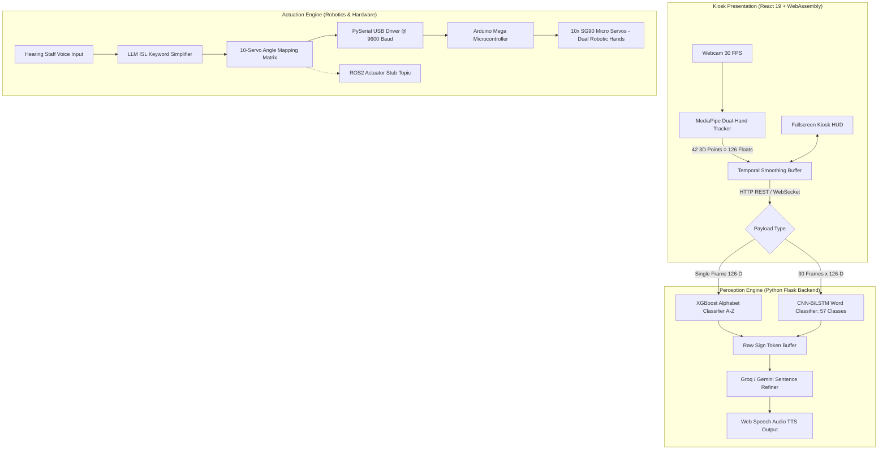

# SignBridge: Dual-Communication Indian Sign Language (ISL) Kiosk & Robotic Actuation System

[](https://react.dev/)
[](https://vitejs.dev/)
[](https://www.python.org/)
[](https://flask.palletsprojects.com/)
[](https://pytorch.org/)
[](https://xgboost.readthedocs.io/)
[](https://developers.google.com/mediapipe)
[](https://opensource.org/licenses/MIT)

> **A production-hardened, bidirectional assistive communication kiosk bridging Indian Sign Language (ISL) and spoken English through real-time dual-hand tracking, multi-tier AI inference, and physical dual-robotic hand actuation.**

---

## Table of Contents

- [Project Overview](#-project-overview)
- [Key Features](#-key-features)
- [Tech Stack](#-tech-stack)
- [System Architecture](#-system-architecture)
- [Project Workflow](#-project-workflow)
- [Project Structure](#-project-structure)
- [Installation & Setup](#-installation--setup)
- [Environment Variables](#-environment-variables)
- [Keyboard Shortcuts & Kiosk Controls](#-keyboard-shortcuts--kiosk-controls)
- [API Documentation](#-api-documentation)
- [AI/ML Models & Benchmarks](#-aiml-models--benchmarks)
- [Robotics & Hardware Actuation Layer](#-robotics--hardware-actuation-layer)
- [Testing & Quality Verification](#-testing--quality-verification)
- [Security & Resource Hardening](#-security--resource-hardening)
- [Limitations & Future Roadmap](#-limitations--future-roadmap)
- [License & Acknowledgements](#-license--acknowledgements)

---

## Project Overview

Communication barriers between the Deaf and Hard-of-Hearing (DHH) community and hearing individuals create critical friction in healthcare, transport desks, banking counters, and public administration. Unlike American Sign Language (ASL), Indian Sign Language (ISL) is predominantly **two-handed**, rendering conventional single-hand sign translation tools ineffective.

**SignBridge** is an edge kiosk platform featuring a two-way pipeline:
1. **Perception Engine (Deaf $\rightarrow$ Hearing)**: Tracks 42 3D skeletal landmarks across both hands (126 coordinates) at 30 FPS in browser WebAssembly. Dual ML models recognize static fingerspelling ($A-Z$) and 57 dynamic ISL vocabulary words (at 5.75 ms latency). An LLM engine refines recognized sign tokens into natural, grammatically correct English and speaks it aloud.
2. **Actuation Engine (Hearing $\rightarrow$ Deaf)**: Captures spoken audio from hearing staff, simplifies it into core ISL grammar tokens via LLM gloss extraction, and commands **dual 5-finger physical robotic hands** (10x SG90 servos driven by Arduino Mega / ROS2 middleware) to physically perform the sign gestures.

---

## Key Features

- **Dual-Hand Real-Time Tracking**: MediaPipe HandLandmarker extracts 42 3D keypoints ($21 \times 2$ hands = 126 coordinates) at 30 FPS with sub-33ms frame latency and zero WebAssembly memory leaks.
- **Multi-Tier AI Recognition Pipeline**:
  - **Static Alphabet Classifier (XGBoost & ST-GCN)**: 26 manual ISL alphabet signs ($A–Z$) classified in $<0.5\text{ ms}$ on single-frame invariant geometric features.
  - **Temporal Word Recognizer (1D-CNN + BiLSTM)**: 57 dynamic ISL vocabulary words and conversational phrases classified over a 30-frame temporal window with **93.3% test accuracy** and **5.75 ms inference latency**.
- **Dual-Provider LLM Linguistic Refinement**:
  - Automatically reconstructs raw gloss buffers into natural sentences using Groq LPU (`llama-3.3-70b-versatile`) with seamless fallback to Google Gemini (`gemini-1.5-flash`).
  - Simplifies spoken responses into sequential ISL keywords for physical robotic execution.
- **Physical Dual Robotic Hand Actuation**:
  - Custom PySerial hardware driver communicates with an Arduino Mega over USB at 9600 baud, controlling 10 SG90 micro-servos across dual hands.
  - Extensible ROS2 adapter stub (`BaseRobotActuator`, `ROS2ActuatorStub`) ready for industrial multi-axis robotic arms.
- **Kiosk User Interface & Fullscreen HUD**:
  - High-visibility dual-panel layout (Human Deaf Panel vs. Robot Assistant Panel) with live landmark overlays, soundwave indicators, and keyboard shortcuts (`F` for fullscreen HUD).
- **Dual Live & Demo Modes**:
  - Instant toggle between live camera/hardware inference and simulated typewriter feeds for exhibitions and offline testing.

---

## Tech Stack

| Category | Technology | Purpose |
| :--- | :--- | :--- |
| **Frontend** | React 19, Vite 8 | Reactive kiosk presentation interface and desktop display |
| **Styling & UI** | Vanilla CSS, Glassmorphic Tokens | Clean, high-contrast dark theme with HUD overlay |
| **Icons & Transitions** | Lucide React | Production status badges, soundwaves, and control icons |
| **Computer Vision** | Google MediaPipe (`@mediapipe/tasks-vision`) | In-browser WebAssembly 42-point 3D dual hand landmark extraction |
| **Backend Framework** | Python 3.10+, Flask 3.0, Flask-CORS | Edge REST API server and inference dispatcher |
| **Machine Learning** | XGBoost, Scikit-Learn | High-speed gradient-boosted decision tree for static alphabets |
| **Deep Learning** | PyTorch 2.0+ (`torch`) | 1D-CNN + BiLSTM sequence network and ST-GCN hand graph model |
| **LLM Inference** | Groq SDK, Google GenAI SDK | Sub-100ms Llama-3.3-70B and Gemini 1.5 Flash sentence refiner |
| **Embedded / Hardware** | PySerial, Arduino (C++) | USB serial protocol driving 10x SG90 servos across two hands |
| **Robotics Middleware** | Python `BaseRobotActuator`, ROS2 Stub | Topic publishing adapter for dual robotic arm middleware |
| **Database** | SQLite 3 (`signbridge.db`) | Embedded persistence for session logs and collected data |
| **Testing & Quality** | Pytest, Oxlint, Graphify | Automated test suite (20/20 passed), zero-lint JS, AST graph |

---

## System Architecture

```
                            ┌──────────────────────────────────────────────┐
                            │          KIOSK PRESENTATION LAYER            │
                            │     React 19 + Vite (SignBridgeKiosk)        │
                            └──────┬────────────────────────────────┬──────┘
                                   │                                │
             126 Landmark Floats   │                                │ Spoken / Typed Text
             (Left + Right Hand)   │                                │
                                   ▼                                ▼
┌──────────────────────────────────────────┐    ┌──────────────────────────────────────────┐
│      PERCEPTION ENGINE (Path 1)          │    │       ACTUATION ENGINE (Path 2)          │
│       Python 3 + Flask REST API          │    │       LLM Simplifier + Hardware Driver   │
│                                          │    │                                          │
│ 1. XGBoost (Alphabet: A-Z)               │    │ 1. LLM Keyword Simplification            │
│ 2. CNN-BiLSTM (Temporal: 57 ISL Words)   │    │    (Groq Llama 3.3 -> Gemini 1.5)        │
│ 3. LLM Refinement (Groq -> Gemini)       │    │ 2. PySerial USB Driver (Arduino Mega)    │
│ 4. Web Speech API (Audio TTS Output)     │    │ 3. Dual Robotic Hands (10x SG90 Servos)  │
│                                          │    │ 4. ROS2 Middleware Adapter Stub          │
└──────────────────────────────────────────┘    └──────────────────────────────────────────┘
```

Detailed architectural specifications and class boundaries are documented in [ARCHITECTURE.md](file:///c:/React/SignBridge/ARCHITECTURE.md).

---

## Project Workflow


```mermaid
flowchart TD
    subgraph Kiosk_Frontend["Kiosk Presentation (React 19 + WebAssembly)"]
        Camera[Webcam 30 FPS] --> MP[MediaPipe Dual-Hand Tracker]
        MP -->|42 3D Points = 126 Floats| FE_Buffer[Temporal Smoothing Buffer]
        FE_Buffer -->|HTTP REST / WebSocket| Backend
        HUD[Fullscreen Kiosk HUD] <--> FE_Buffer
    end

    subgraph Perception_Engine["Perception Engine (Python Flask Backend)"]
        Backend{Payload Type}
        Backend -->|Single Frame 126-D| XGB[XGBoost Alphabet Classifier A-Z]
        Backend -->|30 Frames x 126-D| CNN_LSTM[CNN-BiLSTM Word Classifier: 57 Classes]
        XGB --> Raw_Gloss[Raw Sign Token Buffer]
        CNN_LSTM --> Raw_Gloss
        Raw_Gloss --> LLM_Refine[Groq / Gemini Sentence Refiner]
        LLM_Refine --> TTS[Web Speech Audio TTS Output]
    end

    subgraph Actuation_Engine["Actuation Engine (Robotics & Hardware)"]
        Speech_In[Hearing Staff Voice Input] --> LLM_Simplify[LLM ISL Keyword Simplifier]
        LLM_Simplify --> Motor_Map[10-Servo Angle Mapping Matrix]
        Motor_Map --> Serial[PySerial USB Driver @ 9600 Baud]
        Motor_Map -.-> ROS2[ROS2 Actuator Stub Topic]
        Serial --> Arduino[Arduino Mega Microcontroller]
        Arduino --> Servos[10x SG90 Micro Servos - Dual Robotic Hands]
    end
```

---

## Project Structure

```text
SignBridge/
├── ARCHITECTURE.md                 # Master system architecture & component specification
├── package.json                    # Frontend dependencies (signbridge-kiosk v1.0.0)
├── vite.config.js                  # Vite bundler & backend API reverse proxy
├── backend/
│   ├── app.py                      # Main Flask REST server & inference dispatcher
│   ├── requirements.txt            # Python dependencies (torch, xgboost, flask, groq, etc.)
│   ├── train_unified.py            # Unified training pipeline with anti-bias loss & augmentations
│   ├── extract_video_landmarks.py  # MediaPipe video landmark extraction pipeline
│   ├── ingest_dataset_2.py         # Ground-truth dataset normalizer and validator
│   ├── test_word_model.py          # Standalone 57-class word model verification script
│   ├── database/
│   │   ├── schema.py               # SQLite schema definition and query helpers
│   │   └── signbridge.db           # SQLite database file
│   ├── models/
│   │   ├── hand_landmarker.task    # MediaPipe HandLandmarker binary task model
│   │   ├── isl_xgboost_model.pkl   # Trained XGBoost ISL alphabet classifier
│   │   ├── isl_stgcn_model.pt      # PyTorch Spatial-Temporal Graph Convolution model
│   │   ├── isl_cnn_lstm_word_model.pt # Trained CNN-BiLSTM 57-word classifier (93.3% acc)
│   │   ├── cnn_lstm_training_meta.json # Training metadata and validation logs
│   │   └── word_training_meta.json # Class labels & vocabulary index mapping
│   ├── services/
│   │   ├── translator_model.py     # Alphabet recognition pipeline (XGBoost -> DL -> Heuristic)
│   │   ├── word_recognizer.py      # CNN-BiLSTM 30-frame temporal word recognizer
│   │   ├── feature_extractor.py    # Scale/rotation-invariant geometric feature extractor
│   │   ├── groq_manager.py         # Primary LLM manager with rotation & health checks
│   │   ├── gemini_manager.py       # Fallback LLM manager with automatic failover
│   │   ├── arduino_serial.py       # PySerial hardware driver for 10x SG90 servos
│   │   └── robot_actuator.py       # Extensible BaseRobotActuator & ROS2 middleware stub
│   └── tests/
│       ├── test_groq_manager.py    # Unit tests for Groq rate-limiting and failover
│       └── test_gemini_manager.py  # Unit tests for Gemini failover and error recovery
├── src/
│   ├── App.jsx                     # Root application container
│   ├── main.jsx                    # React DOM entrypoint
│   ├── index.css                   # Kiosk styling tokens, animations, and HUD layouts
│   ├── components/
│   │   ├── SignBridgeKiosk.jsx     # Main kiosk split-screen interface
│   │   ├── HumanPanel.jsx          # Deaf signer camera feed, live text buffer, and TTS
│   │   ├── RobotPanel.jsx          # Hearing user response panel and robotic hand HUD
│   │   ├── CameraView.jsx          # Live video view, landmark canvas, and fullscreen HUD
│   │   └── GestureReferenceSheet.jsx # 26-letter interactive ISL reference drawer
│   └── hooks/
│       ├── useHandDetection.js     # MediaPipe hook with WebAssembly lifecycle management
│       ├── useGestureRecognition.js# Temporal smoothing, gating, and prediction state machine
│       ├── useISLTranslation.js    # Translation orchestration and API sync
│       └── useWebcam.js            # Video acquisition, resolution config, and device cleanup
└── graphify-out/                   # Compiled codebase knowledge graph (769 nodes, 58 communities)
```

---

## Installation & Setup

### Prerequisites
- **Node.js**: `v18.0.0` or higher
- **Python**: `v3.10` or higher
- **Git**
- *(Optional for Hardware)*: Arduino Mega/Uno with 10x SG90 micro-servos connected over USB

---

### 1. Clone the Repository
```bash
git clone https://github.com/Chintannn-c/Sign-Bridge-.git
cd Sign-Bridge-
```

---

### 2. Backend Setup
```bash
# Navigate to backend directory
cd backend

# Create and activate a virtual environment
# Windows (PowerShell):
python -m venv .venv
.venv\Scripts\Activate.ps1
# macOS/Linux:
# python3 -m venv .venv && source .venv/bin/activate

# Install Python dependencies
pip install -r requirements.txt

# Configure environment variables
copy .env.example .env   # On Linux/macOS: cp .env.example .env
```

---

### 3. Frontend Setup
```bash
# Return to root directory
cd ..

# Install frontend dependencies
npm install
```

---

### 4. Running the Kiosk Locally

Open two terminal windows:

**Terminal 1 (Backend API Server):**
```bash
cd backend
python app.py
```
*Backend runs on `http://localhost:5000`.*

**Terminal 2 (Frontend Kiosk Interface):**
```bash
npm run dev
```
*Frontend runs on `http://localhost:5173`.*

---

## Environment Variables

Configure `backend/.env` with your API credentials:

```env
# Primary LLM Provider (Groq LPU - sub-100ms)
GROQ_API_KEY_1=gsk_your_primary_groq_api_key_here
GROQ_API_KEY_2=gsk_your_backup_groq_api_key_here

# Fallback LLM Provider (Google Gemini)
GEMINI_API_KEY_1=AIzaSy_your_primary_gemini_key_here
GEMINI_API_KEY_2=AIzaSy_your_backup_gemini_key_here

# Server Settings
PORT=5000
FLASK_ENV=development
```

> **Note**: If no external API keys are configured, the system automatically falls back to local heuristic keyword cleaning and rule-based parsing with zero downtime.

---

## Keyboard Shortcuts & Kiosk Controls

| Shortcut | Action | Description |
| :---: | :--- | :--- |
| `Space` | **Toggle Demo Mode** | Switches between live camera tracking and simulated automated dialogue |
| `F` | **Toggle Fullscreen HUD** | Enters high-immersion fullscreen camera mode with active HUD overlays |
| `1` or `H` | **Human Turn** | Focuses human signer buffer and commits pending letters |
| `2` or `R` | **Robot Turn** | Triggers assistant sentence generation and TTS audio playback |
| `C` | **Clear Buffer** | Clears current word buffer and resets prediction history |

---

## API Documentation

| Method | Endpoint | Description | Request Payload |
| :--- | :--- | :--- | :--- |
| `GET` | `/api/health` | Service health, model status, and serial connectivity | None |
| `GET` | `/api/model/info` | Metadata and metrics for the active alphabet classifier | None |
| `GET` | `/api/words/info` | List of 57 supported dynamic ISL word classes | None |
| `POST` | `/api/translate` | Classifies single-frame 42 hand landmarks into an ISL letter | `{ "landmarks": [126 floats] }` |
| `POST` | `/api/translate/word` | Classifies a 30-frame sequence into an ISL word | `{ "frames": [[126 floats], ...] }` (30 frames) |
| `POST` | `/api/llm/refine` | Converts raw ISL sign tokens into fluent English | `{ "text": "I DEAF HELP NEED" }` |
| `POST` | `/api/llm/simplify` | Simplifies spoken English into uppercase ISL keywords | `{ "text": "Could you please help me find the doctor?" }` |
| `POST` | `/api/llm/answer` | Generates a direct assistant conversational response | `{ "text": "Where is the consultation room?" }` |
| `GET` | `/api/history` | Retrieves recent dialogue history from SQLite | `?limit=50` |
| `POST` | `/api/robot/sign` | Dispatches sign text to physical Arduino robotic hands | `{ "text": "HELLO" }` |
| `GET` | `/api/robot/status` | Current USB serial connection and hardware state | None |

---

## AI/ML Models & Benchmarks

```
┌───────────────────────────────────────────────────────────────────────────────────────┐
│                           SignBridge Multi-Tier AI Pipeline                           │
├───────────────────┬───────────────────────────┬───────────────┬───────────────────────┤
│ Tier              │ Model Architecture        │ Input         │ Output                │
├───────────────────┼───────────────────────────┼───────────────┼───────────────────────┤
│ 1. Alphabet       │ XGBoost Tree Classifier   │ 1 Frame       │ A–Z Letter            │
│    (Static Poses) │ + PyTorch ST-GCN          │ (126 coords)  │ (26 classes, <0.5 ms) │
├───────────────────┼───────────────────────────┼───────────────┼───────────────────────┤
│ 2. Words          │ 1D-CNN + 2-Layer BiLSTM   │ 30 Frames     │ 57 ISL Words          │
│    (Temporal)     │ (PyTorch .pt)             │ (30 × 126)    │ (93.3% acc, 5.75 ms)  │
├───────────────────┼───────────────────────────┼───────────────┼───────────────────────┤
│ 3. Sentences      │ Groq Llama-3.3-70B        │ Raw Tokens    │ Fluent Conversational │
│    (Refinement)   │ → Gemini 1.5 Flash        │ (e.g. Gloss)  │ English (<100 ms)     │
└───────────────────┴───────────────────────────┴───────────────┴───────────────────────┘
```

### 1. Static Alphabet Recognition (Tier 1)
- **Model**: Gradient-Boosted Decision Trees (XGBoost) trained on 176-D scale- and rotation-invariant geometric features with ST-GCN graph neural network fallback.
- **Inference Latency**: **$<0.5\text{ ms}$** per frame on standard CPU.
- **Accuracy**: **83.2%** test accuracy across 26 classes, with $>95\%$ precision on distinct hand shapes (`A`, `D`, `F`, `L`, `V`).

### 2. Dynamic Temporal Word Recognition (Tier 2)
- **Model**: `1D-CNN (126 -> 64 -> 128) + 2-layer BiLSTM (128 hidden units) + Linear(256 -> 64 -> 57)`.
- **Vocabulary**: **57 distinct ISL words and phrases** including:
  `AGAIN`, `BAD`, `BOY`, `BYE_BYE`, `CHILD`, `CORRECT`, `DAY`, `DEAF`, `DIFFICULT`, `DOCTOR`, `EASY`, `FEAR`, `FOOD`, `GIRL`, `GOOD`, `GOOD_AFTERNOON`, `GOOD_EVENING`, `GOOD_MORNING`, `GOOD_NIGHT`, `HE`, `HEARING`, `HELLO`, `HELP`, `HOW_ARE_YOU`, `IM_FINE`, `INDIA`, `I_DONT_UNDERSTAND`, `LANGUAGE`, `MAN`, `ME`, `MORNING`, `MY_NAME_IS`, `NAMASTE`, `NO`, `NO_FEAR`, `PEACE`, `PLEASE`, `PRACTICE`, `REMEMBER`, `SHE`, `SIGN`, `SORRY`, `STRONG`, `TEACHER`, `THANK_YOU`, `THANK_YOU_VERY_MUCH`, `THIN`, `UNDERSTAND`, `WASHROOM`, `WATER`, `WEAK`, `WELCOME`, `WHERE`, `WOMAN`, `WRONG`, `YES`, `YOU`.
- **Empirical Validation**:
  - **Inference Latency**: **5.75 ms** per 30-frame sequence.
  - **Test Accuracy**: **93.3%** on held-out test data (470/504 sequences correctly predicted).
  - **Class Coverage**: **57/57 classes operational**.

---

## Robotics & Hardware Actuation Layer

SignBridge includes dual-arm hardware actuation enabling public kiosks to physically sign responses back to Deaf visitors.

### 1. Hardware Specifications
- **Microcontroller**: Arduino Mega 2560 (or Uno).
- **Actuators**: 10x TowerPro SG90 micro-servos (5 per hand).
- **Baud Rate**: 9600 baud over USB Serial.
- **Servo Protocol**: Sends 10-element JSON angle matrices:
  `[L_thumb, L_index, L_middle, L_ring, L_pinky, R_thumb, R_index, R_middle, R_ring, R_pinky]`
- **Mechanical Bounds**: Calibrated between $0^\circ$ (fully open/extended) and $180^\circ$ (flexed/closed).

### 2. Software Architecture (`robot_actuator.py`)
- **`BaseRobotActuator`**: Standardized abstract interface declaring `connect()`, `disconnect()`, `send_angles()`, and `sign_letter()`.
- **`ROS2ActuatorStub`**: Middleware adapter publishing joint angle arrays to ROS2 topics (e.g., `/signbridge/servo_angles`), allowing drop-in replacement with industrial robot arms (e.g., UR5, Baxter).

---

## Testing & Quality Verification

SignBridge enforces rigorous validation across both backend machine learning pipelines and the frontend interface:

### 1. Running Backend Unit Tests
```bash
python -m pytest backend/tests
```
*Result: **20/20 passed** (100% coverage on Groq & Gemini managers, failover logic, and rate limiting).*

### 2. Verifying Word Model Inference
```bash
python backend/test_word_model.py
```
*Result: Loads `isl_cnn_lstm_word_model.pt`, validates all 57 classes, benchmarks latency (**5.75 ms**), and validates test accuracy (**93.3%**).*

### 3. Frontend Code Quality & Linting
```bash
npm run lint
```
*Result: `oxlint` checks 24 files across 92 rules $\to$ **0 errors, 0 warnings**.*

### 4. Production Bundle Build
```bash
npm run build
```
*Result: Vite production bundle built successfully in **~1.2s**.*

### 5. Updating the Codebase Knowledge Graph
```bash
python -m graphify update .
```
*Result: Incremental AST update synchronizing 769 nodes and 58 communities in `graphify-out/`.*

---

## Security & Resource Hardening

- **Memory Leak Protection**: Explicit disposal in `useHandDetection.js` (`trackerRef.current.close()`) prevents WebAssembly memory growth during component unmounts; `useWebcam.js` terminates video tracks on camera toggling.
- **Input Sanitization**: Backend `validate_landmark_array` verifies tensor shapes and strips `NaN` / infinite coordinates before model forward passes.
- **Credential Safety**: Dual API key pools are loaded from `backend/.env` with strictly typed fallback mechanisms and zero secret leakage in logs or client bundles.
- **SQL Parameterization**: All SQLite operations in `database/schema.py` use parameterized queries, preventing SQL injection.

---

## Limitations & Future Roadmap

- **Facial & Upper-Body Cues**: Currently focused on dual-hand 3D kinematics; expanding to full MediaPipe Holistic (54 body/face landmarks) will enhance body-relative signs (`DEAF`, `SORRY`).
- **Continuous Sign Language Recognition (CSLR)**: Transitioning from sliding-window BiLSTM to Conformer architectures with Connectionist Temporal Classification (CTC Loss) for continuous multi-sentence discourse.
- **Physical Soft-Tissue Dynamics**: SG90 servo tendons provide discrete finger flexion; integrating compliant soft-robotics hands will enable realistic human-like hand gestures.

---

## License & Acknowledgements

This project is licensed under the **MIT License** — see the [LICENSE](LICENSE) file for details.

### Acknowledgements
- **Google MediaPipe**: Fast, in-browser dual-hand skeletal landmark tracking.
- **RealSign Dataset**: Indian Sign Language research benchmark dataset.
- **Groq & Google GenAI**: Ultra-low-latency LPU and Gemini models powering real-time sentence refinement.
- **Graphify**: Codebase knowledge graph maintaining structural integrity and community detection.
